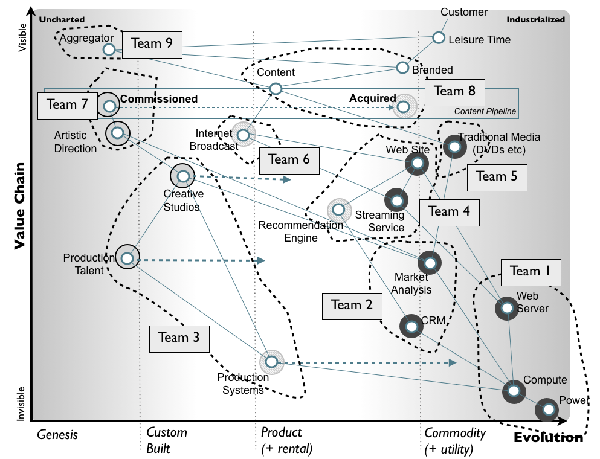
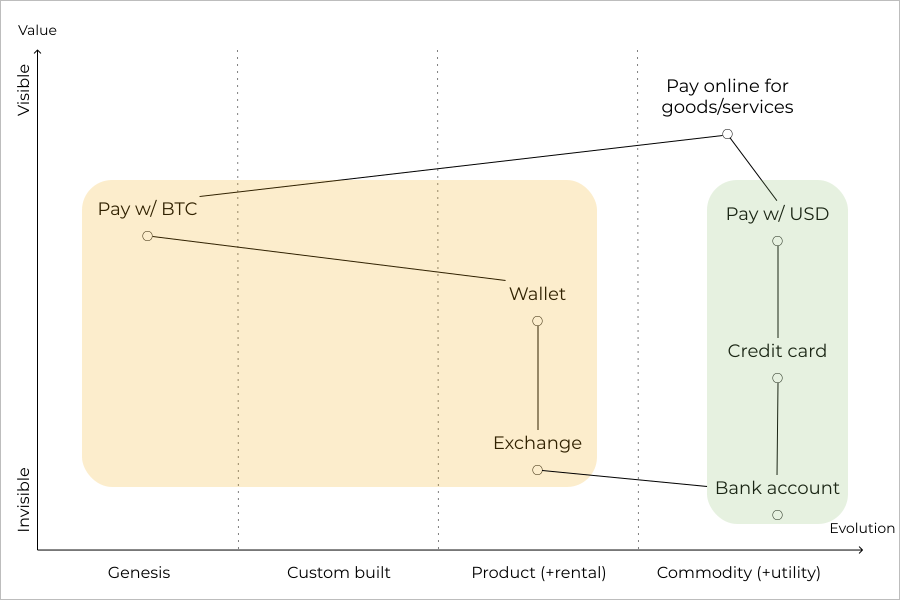
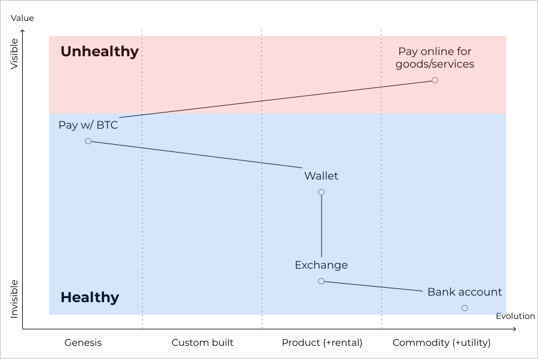
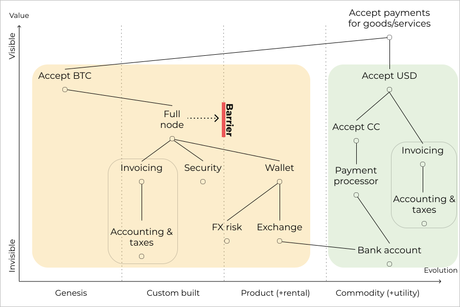
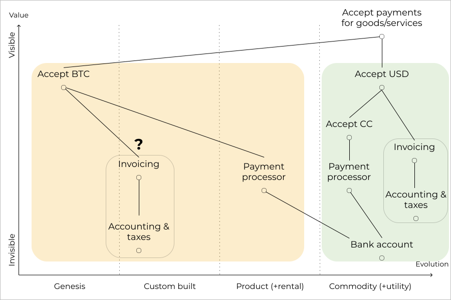
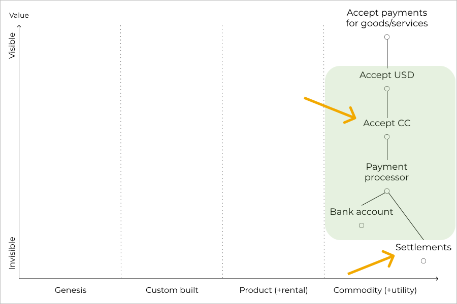
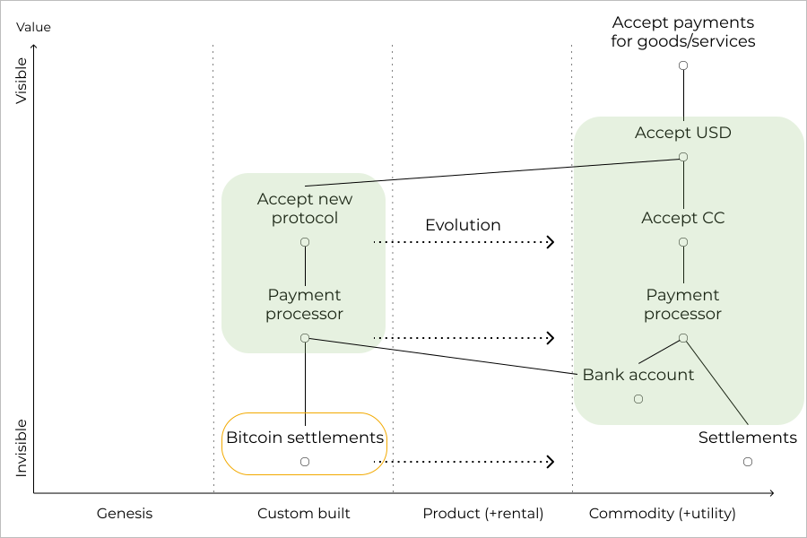

This is the first in a series of blog posts aimed at understanding the crypto ecosystem through [Wardley maps.](https://medium.com/wardleymaps) These maps are commonly used to facilitate business strategy decisions through value chain analysis in the context of technological evolution. Wardley maps are truly remarkable. Studying business strategy through mapping feels like learning a whole new game while strategy discussions lacking maps inevitably start to feel myopic.

Why apply mapping to the crypto ecosystem? Because far too many publications on crypto are driven by ideology or focus on technical solutions without fully understanding the problems first. Here, we view crypto as a means to an end, and Wardley maps allow us to anchor all discussions in user needs, so we can analyse crypto’s place in the value chain and anticipate future changes.

_Source:_ [Simon Wardley - An introduction to Wardley (Value Chain) Mapping.](https://blog.gardeviance.org/2015/02/an-introduction-to-wardley-value-chain.html) _License:_ [CC BY-SA 3.0.](https://creativecommons.org/licenses/by-sa/3.0/)

A Wardley map is quite literally a map of the terrain that a business or technology operates in. [Mapping is](https://twitter.com/swardley/status/700636891624787968) understanding our purpose, discovering the terrain, identifying the natural forces that act in it (climate), learning general patterns of action (doctrine) and then developing context specific gameplay. The two core concepts of maps are the value chain and technological evolution. While the term value chain generally refers to the activities of a company, here we use it in a more general sense meaning all activities required to fulfill a need. The evolutionary stage of a technology [is determined](https://medium.com/wardleymaps/finding-a-new-purpose-8c60c9484d3b) by its ubiquity in its applicable market and the amount of uncertainty around its use. The concept of technological evolution is critical in understanding how different components of a value chain interact and change.

The goal of this post is to introduce the basics of mapping through a simplified example. We will take Bitcoin as described in [Satoshi’s paper](https://bitcoin.org/bitcoin.pdf) and map it as a means of online payments for goods and services in the United States, finally using our maps to devise a flanking maneuver to take over credit cards. Readers are encouraged to consult Simon Wardley's excellent [book](https://medium.com/wardleymaps) for a more thorough introduction on mapping.

## Payments by consumers

Online payments for goods and services is a well understood and universally accepted activity. The standard practice is paying in dollars with a credit card. Having a credit card depends on having a bank account. The [Bitcoin paper](https://bitcoin.org/bitcoin.pdf) proposes to improve online payments by introducing a trustless and permissionless peer-to-peer electronic payment system that would reduce transaction costs. Transactions are executed in the system by transferring an electronic coin (bitcoin) between parties. Today consumers can acquire bitcoins on an exchange funded from their bank accounts. The coins are then moved to their wallets which is used to facilitate payments. Since Bitcoin is a peer-to-peer system, both parties to a transaction must come into possession of the coin at some point. It follows that, in order to be effective, parties must know either the value of bitcoins relative to an other currency or the value of goods denominated in bitcoins.

Bitcoin is a new form of currency and its value is poorly understood as evidenced by its volatility. Paying for goods and services with bitcoins is rare and considered a novel practice. While Bitcoin is confusing for ordinary people, it has excited a large group of dedicated followers who believe it has a high potential and engage in various forms of experimentation and gambling. Thus Bitcoin as a means of online payments is designated as a genesis level technology in [Simon Wardley’s terminology.](https://medium.com/wardleymaps/finding-a-path-cdb1249078c0) Interestingly, while the activity of paying with bitcoins hasn’t left the genesis stage, wallets and exchanges have become commonplace thanks to uses other than online payments. Customers choose wallets and exchanges based on features and trust them with significant amounts of money, so we can conclude that they have reached the product stage of evolution. Let’s display all this on a map!

_Map 1: Making payments with USD and BTC_

The first thing to notice in Map 1 are the axes: elements of the value chain are organised along the vertical axis based on their visibility to the user and they are ordered along the horizontal axis based on the stage of technological evolution that they have reached. The value chains are anchored to one node: the user need of payments. The value chain for paying with dollars is circled in green and the value chain for bitcoins is circled in orange. The placement of nodes along the evolution-axis follows the discussion above. Placement along the vertical-axis is less important in this case, as we only display elements of the value chains that are visible to consumers anyway.

What we have in the map is a situated representation of payments with both bitcoins and dollars and it is quite telling to the trained eye: The value chain of dollar payments is compact and has reached a final stage of evolution while Bitcoin’s is all over the map. This powerful visual representation depicts the business strategy equivalent of fighting an uphill battle for the adoption of Bitcoin payments.

_Map 2: BTC value chain bisected for healthy and unhealthy parts_

That a genesis level technology’s value chain involves components from more advanced evolutionary stages is in itself not a problem, in fact it is expected, as new developments usually build on established technologies. The challenges come from trying to support an established activity (online payments) through a genesis level technology, as these new technologies are by definition unreliable and hard to use. In general, a value chain is healthy if no dependencies of a node are found in a lower stage of technological evolution. We mark the healthy and unhealthy parts of the value chain in Map 2.

## Accepting payments

We have built our first map and it has proven to be a powerful display of Bitcoin's challenges in taking over online payments, but we haven’t been able to develop any new insights based on the map. Payments are a two-sided affair, so let’s map the more complex scenario of accepting payments as a merchant and see if we can learn something new.

_Map 3: Accepting payments with BTC and USD_

Looking at Map 3 a familiar picture arises: Accepting payments with Bitcoin has more complicated dependencies than accepting payments with dollars and its value chain is in a lower stage of technological evolution. The biggest challenge for merchants seems to be operating a full node which is [advisable](https://en.bitcoin.it/wiki/Why_Your_Business_Should_Use_a_Full_Node_to_Accept_Bitcoin) for better security. Running a full node can not be outsourced, as that would negate the core value proposition of Bitcoin: trustlessness. This is visualized on the map as an evolutionary barrier. Finally, notice that invoicing, accounting and tax practices are displayed twice on the map. They must be reinvented for Bitcoin due to how transactions work (eg. unique address generation) and partly due to regulatory uncertainties. Such [duplication](https://medium.com/wardleymaps/doctrine-8bb0015688e5#2db1) in the value chain is an other unhealthy pattern to look out for.

_Map 4. Accepting BTC through a payment processor_

If merchants were to do everything themselves, the value chain of accepting dollars would look even more complicated than that of Bitcoin in Map 3. The solution is the introduction of payment processors who take care of the complexity of processing credit card payments. Some payment processors have ventured into accepting cryptocurrencies as well and this has indeed simplified the value chain as displayed in Map 4. However, the introduction of payment processors is a Pyrrhic victory, as the trustlessness property has now been lost, which means that the only remaining technological advantage is supposedly lower transaction costs. At the same time, the challenges of having components in lower stages of evolution have not been addressed and unless the merchant uses the same payment processor for dollars and bitcoins, duplication will remain.

## The settlement flank

The original goal of the Bitcoin paper was improving online payments for both merchants and consumers, but the maps that we have developed so far paint a bleak picture of its prospects. Yet there is clearly room for improvement, so let's see if we can devise a plan as an exercise to reach the paper's goal of cheaper payments while building on Satoshi's technological breakthroughs.

_Map 5: Possible points of attack employing a Bitcoin settlement layer_

Inspecting Maps 1 and 4, the major obstacle to Bitcoin's adoption for online payments seems to be its aspiration as a standalone currency due to the burden of adopting novel practices for merchants and consumers. A new currency is necessary for peer-to-peer payments, but by giving up the trustlessness property with the introduction of payment processors, there is no technical reason anymore for a currency distinct from dollars. Thus, we could instead try to harness Bitcoin technology for cheaper payments by repositioning it from a currency to the the settlement layer. We could either try to get credit card networks to change their technology in the settlement layer or try to replace credit cards with a new dollar payment protocol that is powered by settlements on the Bitcoin blockchain. The possible points of attack are marked with orange arrows on Map 5. (Elements of the value chain between payment processors and settlements are omitted for clarity.)

The fundamental problem with credit cards is their weak security which necessitates chargebacks that are in turn a major cost factor for credit card payments. This means that getting credit card networks to change the settlement layer would lead to lower customer value compared to a new, secure protocol all other things being equal. In any case, both plays face considerable difficulties. This is due to multi-party inertia and new technology risks in the case of credit card settlements and due to the usual challenges of establishing a two-sided market in the case of a new protocol.

_Map 6: Sketch of an attack on credit cards employing a Bitcoin settlement layer from a merchant's side_

Map 6 is a rough sketch of an attack on credit cards by a new payment protocol using a Bitcoin settlement layer (as viewed from a merchant's side). The goal is to replace credit cards in their applicable market while growing the overall size of the market. The dotted arrows signify the desired evolution of the new protocol's components through which process certainty around its use increases and the applicable market grows. Notice that the Bitcoin settlement layer is transparent to merchants, just as settlements are transparent with credit cards.

Questions around duplication and supporting established practices with early stage technologies remain. Addressing these issues is very much dependent on the particulars of the landscape, so instead of further developing our hypothetical scenario, in the following posts we will turn our attention to mapping the crypto payments landscape as it evolved in the 10 years that passed since the publication of the Bitcoin paper and try to anticipate where it's headed.
