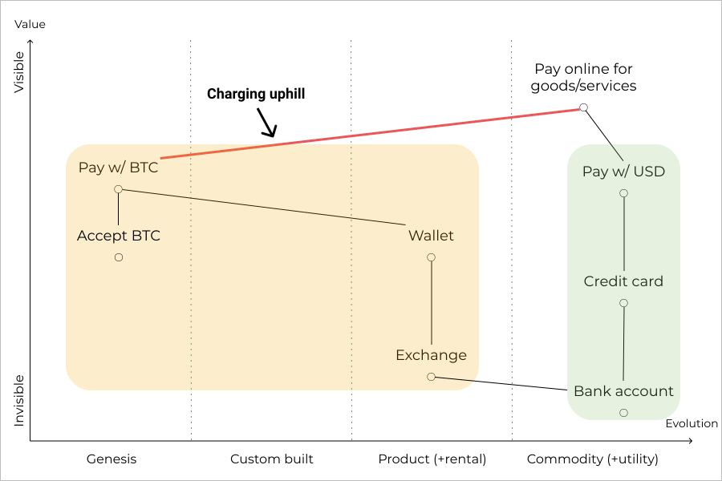
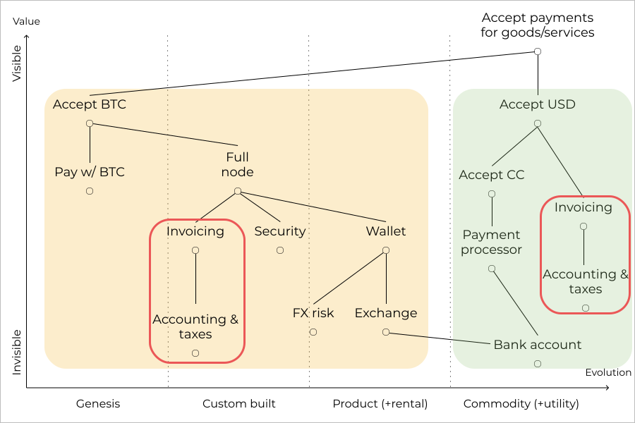
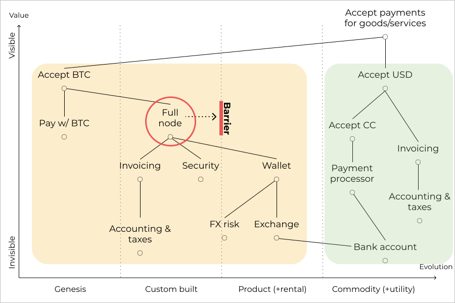
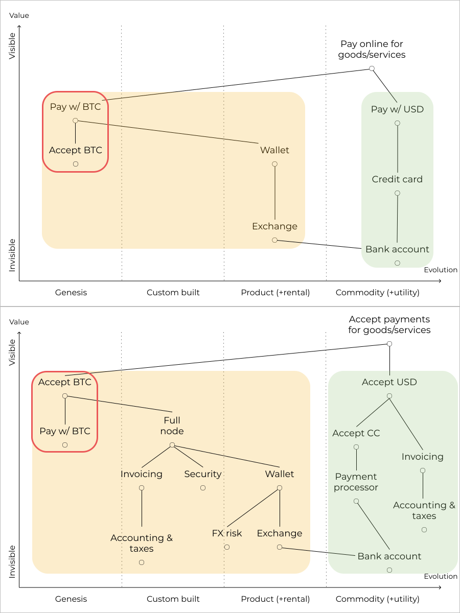

This is the second post in a series aimed at understanding the crypto ecosystem through [Wardley maps.](https://medium.com/wardleymaps) The [first post](https://blog.agostbiro.com/2019/06/mapping-crypto-a-primer/) introduced mapping with the somewhat contrived example of applying Bitcoin to online payments and identified many of the challenges around launching novel payment solutions. In this post, we will examine these pitfalls in more detail and see how the Litecoin, Monero, Ripple, Stellar and Z-cash projects handled them compared to Bitcoin.

## #1 Early stage tech vs industrialized value chain

_Map 1: Making payments with USD and BTC_

The first challenge we identified in Bitcoin's adoption for online payments was the fact that it tried to challenge an established activity supported by an industrialized value chain with a genesis level technology. This is what we described as fighting an uphill battle, and display again on Map 1. The problem is not specific to Bitcoin or crypto, but it's something that all entrants to payments face as credit cards in the US already [work very well](https://stratechery.com/2014/problem-payments/) for consumers (as evidenced by their rightmost position on Map 1).

The answer is introducing the new technology in a niche and creating a new payment solution. By creating a new solution, the inevitable uncertainties around the novel technology become acceptable and by finding the appropriate niche, users are more incentivized to make the switch. The niche can be either geographical (find a country where online payments are less evolved) or functional (find a market that credit cards don't serve). In addition, it's easier to focus on a good user experience for a small group, which is always a challenge with early stage tech.

**Who got this right?** Monero and Z-cash by specializing in anonymous payments and creating new means of payment.

**Who got this wrong?** Bitcoin and Litecoin created new payment solutions, but went too wide initially. Ripple and Stellar successfully identified niches (eg. international settlements), but failed to create new payment solutions.

## #2 Duplication

_Map 2: Duplication when accepting payments with USD and BTC_

By trying to replace the US dollar as the unit of account, cryptocurrencies have introduced duplication in the value chain as pictured in Map 2. Merchants accepting peer-to-peer cryptocurrencies alongside dollars have to invent new invoicing and accounting practices while facing regulatory uncertainties and they have to operate these practices in parallel to their highly evolved practices for dollars. The simplest solution is to keep dollars as the unit of account so that existing invoicing and accounting practices can be leveraged.

**Who got this right?** Ripple and Stellar by targeting settlements.

**Who got this wrong?** Bitcoin, Litecoin, Monero and Z-cash by introducing a new unit of account.

## #3 Evolutionary barrier

_Map 3: Evolutionary barrier in accepting payments with BTC_

Components of a value chain are [driven by competition](https://medium.com/wardleymaps/finding-a-new-purpose-8c60c9484d3b#7478) to move along the evolutionary axis. The evolutionary stage of a technology [is determined ](https://medium.com/wardleymaps/finding-a-new-purpose-8c60c9484d3b#544b)by ubiquity in its applicable market and the amount of uncertainty around its use. The value chain adapts to the evolution of its components and dependencies start to get sourced externally as transaction costs become lower thanks to an increasing certainty around use. Once a component is commoditised and thus reaches the ultimate stage of evolution, there is no choice but to acquire it on the open market. Not many companies operate their own power plants after all.

Many crypto projects providing payments with trustlessness or anonymity properties rely on peer-to-peer transactions resulting in dependencies that can not be sourced externally. For example, when accepting Bitcoin payments, merchants have to run a full node for best security (pictured as an evolutionary barrier on Map 3), but if they were to contract this out to third parties, the trustlessness property of Bitcoin would be lost. Such evolutionary barriers place a hard limit on the ubiquity of the technology as it limits the user base to early adopters. Alternatively, if the same activity can be supported with a value chain whose components can be sourced externally, that approach will certainly win.

**Who got this right?** Ripple and Stellar at the cost of giving up the trustlessness property.

**Who got this wrong?** Bitcoin, Litecoin, Monero and Z-cash due to technical limitations.

## #4 Kickstarting a two-sided market without users

_Map 4: Circular dependencies in payments_

Payment networks are the textbook example of the difficulties of kickstarting a two-sided market since they require buy-in from both consumers and merchants, but neither group is incentivized to move first. The circular dependencies are highlighted in Map 4. Bitcoin invented novel solutions to this problem through mining and ideological evangelism. Its roots in the cypherpunk and libertarian communities provided strong ideological motivations for adoption from a dedicated group of merchants and consumers, which culminated in the famous case of an online hardware vendor putting up a billboard to advertise Bitcoin. Using mining as a means of distribution was another masterstroke, as it supplied early adopters with bitcoins to spend while providing a strong incentive to learn about the technology and drive its adoption. Later many crypto projects successfully employed similar distribution schemes, but trying to capitalize on ideological motivations yielded diminishing returns as the competition for attention grew in the crypto space.

_Memory Dealers billboard in Santa Clara, CA advertising Bitcoin in 2011._  
_Source:_ [Post](https://forum.bitcoin.com/ama-ask-me-anything/i-m-roger-ver-the-first-bitcoin-angel-investor-ask-me-anything-t2719.html) _by Roger Ver on the Bitcoin.com forum._

While Bitcoin's original efforts were ingenious, we must realize that companies that have existing relationships with merchants and consumers and own a direct distribution channel are in a superior strategic position to kickstart a payment network. The following are the best positioned players among US tech companies:

- Facebook with its messaging apps and advertising clients
- Google with Android and advertising clients
- Paypal with consumer and merchant accounts and Venmo
- Square with relatively few online merchant accounts, but a presence in brick-and-mortar retail that none of the above companies have, in addition to the Cash app and a debit card

**Who got this right?** Bitcoin by playing on financial and ideological incentives. Ripple and Stellar by targeting settlements and side-stepping the issue.

**Who got this wrong?** Litecoin, Monero and Z-cash by copying the Bitcoin playbook without adapting to the new landscape.
