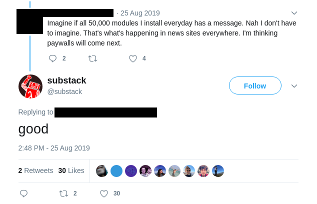

Independent open source developers cannot profit from their work directly today. Sponsorships and donations are commendable, but they rarely provide enough income to pay the bills, much less an income comparable to industry salaries.[^1] What’s missing is a business model that lets independent developers capture a portion of the value they create.

A new business model must carefully balance the interests of open source developers, their users and the companies that employ them. It must not change open source workflows, it should not change how open source software is adopted and it should primarily burden those who derive the most value from the project. Sponsorships and donations satisfy the first two conditions, but as apparent, altruistic systems don’t work at internet scale and the voluntary nature of these expenses means that corporations must not only be willing to take on the expenses, but also the additional bureaucracy involved in approving voluntary spending. This is in addition to the extensive self-promotion efforts required from open source developers to gain patrons.

## Existing models

Recently, four new business models have been experimented with for independent developers: dual-licensing, pay-for-source, pay-for-support and ads.

Out of these, the dual-licensing and pay-for-source models are the least promising in my opinion. With dual-licensing, users are unsure what constitutes experimentation and what is commercial use, open source adoption is suddenly a sales process and the dual-license creates a legal risk for companies that further hinders adoption. I believe the fact that VC-funded open source startups prefer SaaS or open-core models to dual-licensing is proof enough that it is not a promising avenue for individual developers.[^2]

The second model, pay-for-source, was most recently experimented with by a startup called [GitRoyalty.](https://gitroyalty.com/) They implemented a model where parts of the repository are stored in a private submodule and users are charged for access to this submodule. Two months after launch, it seems that the model hasn’t been successful unfortunately.[^3] I believe that they have introduced too much friction and in the wrong places: GitRoyalty makes open source maintainer’s jobs harder and discourages new contributors, while also hindering adoption and creating bureaucracy and uncertainty for users.

The third model, paid support services facilitated by platforms, can work, but I believe this to be a last resort for most developers. Nobody gets into open source to become a corporate support engineer. Not to mention that this model has the undesirable effect of moving leverage from open source creators to the facilitating platform, as the platform owns the customer relationships while support staff is replaceable.

Finally, the ad model was most recently experimented with in a short-lived, but enlightening [experiment by Feross Aboukhadijeh.](https://feross.org/funding-experiment-recap/) Feross put a spin on the traditional model of displaying advertisement on websites and built an NPM module that displayed a sponsored message when added as a dependency. While open source developers generally welcomed the experiment, there was a backlash from users that made the advertiser pull out from the project quickly.

I believe Feross' experiment was a step in the right direction, but it needs to be driven further. Ad supported independent online publishers have been struggling for a long time now, but those that introduced subscription models, thrive.[^4]

_Source: [Twitter](https://twitter.com/substack/status/1165742866796183554)_

## Paywall For Docs

Yes, the new business model I propose here is a paywall for documentation sites, where daily users have to log in and pay a monthly subscription fee to access the site. Teams pay a fixed subscription price per seat and individual users pay a variable price with an option to pay $0. Authentication, subscription management and payouts are provided by a [forkable company](https://blog.agostbiro.net/2020/01/a-forkable-company/) called [Dokknet.](https://dokknet.com/) The paywall integrates with existing documentation frameworks on the front end and integrates with hosting providers on the back end.[^5] [Dokknet](https://dokknet.com) charges 3% of revenues + Stripe fees with the long term goal of providing the services at a flat 1% fee (including payment processing charges).

### Why is this a good idea?

Because the paywall lets open source developers get paid for simply writing great software and documentation and it makes it easy for companies to pay for their work. Teams can sign up for a subscription with a credit card like they do for all other developer tools. And it doesn’t interfere with how open source software is built or adopted.

### What can go wrong?

Well, most paywalls suck. But they don’t have to! The goal is not to block access, but to impose a slight convenience tax on daily users while making the experience as ergonomic as possible. This can be achieved with generous unauthenticated views, a single login for all documentation sites behind a paywall, and an unobtrusive design that integrates with the documentation framework used by the project. For those projects that are currently supported by donations or sponsorships, patrons should be given paywall access. This can be easily achieved by white-listing certain emails for the project.

A potential problem is that if money can be made by hosting documentation, suddenly many parties are incentivized to re-host documentation sites which they can legally do under open source licenses. Since we want the source of the documentation to remain open and forkable, the solution is to introduce a new open source license for documentation that does not grant the right to host an unmodified version.

Finally, there are various solutions that aggregate the documentation of multiple projects and present it in a more readable or searchable format, sometimes with offline support. These aggregators would be broken by the paywall. However, integrating the aggregators with the paywall would be in the interest of both documentation and the aggregator creators if they could make money with it, so I hope that a solution can be found that preserves these aggregators.

### What problem does it not solve?

A documentation paywall is a good solution for larger libraries and frameworks and some apps, but it doesn’t solve funding for micro-libraries and transitive dependencies.[^6] For micro-libraries, the solution is to aggregate them into a collection, and once open source developers start making money, they can pay for transitive dependencies.

### Why you should support this

The gist of it is that if you as a developer regularly finish your day with 10+ tabs open into a doc site and you make money from it, you or your employer should pay for it. This will create a world where developers of successful open source projects can quit their jobs and earn a dependable income in proportion to the success of their project. Users of open source software benefit as well, because the paywall will directly lead to better documentation, and the existence of a successful business model will result in more and better open source software in the long run.

---
_You can learn more about the [Dokknet](https://dokknet.com/) paywall-as-a-service [here.](https://dokknet.com/)_

[^1]: I could only find three individuals across Patreon and Open Collective who make a consistent six-figure salary from full time independent open source work. André Staltz explored this problem in more detail in his post, [Software Below the Poverty Line.](https://staltz.com/software-below-the-poverty-line.html)
[^2]: See [Open Source: From Community to Commercialization](https://a16z.com/2019/10/04/commercializing-open-source/) by a16z for an overview of VC-backed OS business models.
[^3]: See revenue on [https://gitroyalty.com/discover](https://gitroyalty.com/discover)
[^4]: Think Memberful, Substack and most recently Ghost Members.
[^5]: Read more in the [paywall design.](https://blog.agostbiro.net/2020/01/dokknet-paywall-design/)\
[^6]: Transitive dependencies are projects that are fundamental to larger projects, but end users don’t often interact with them.

