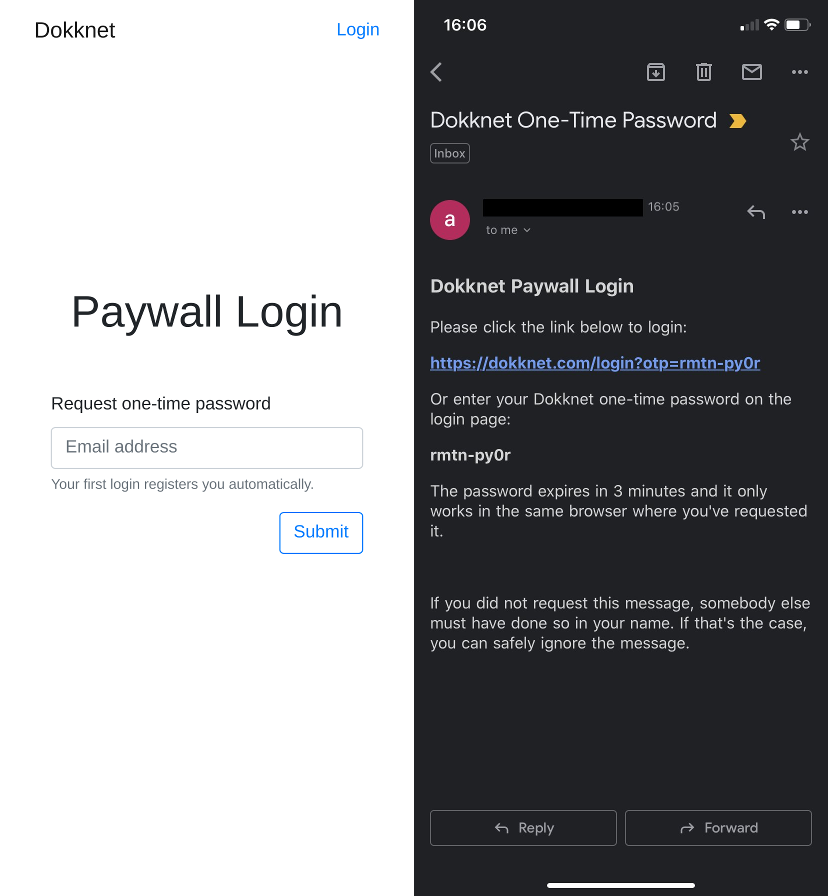
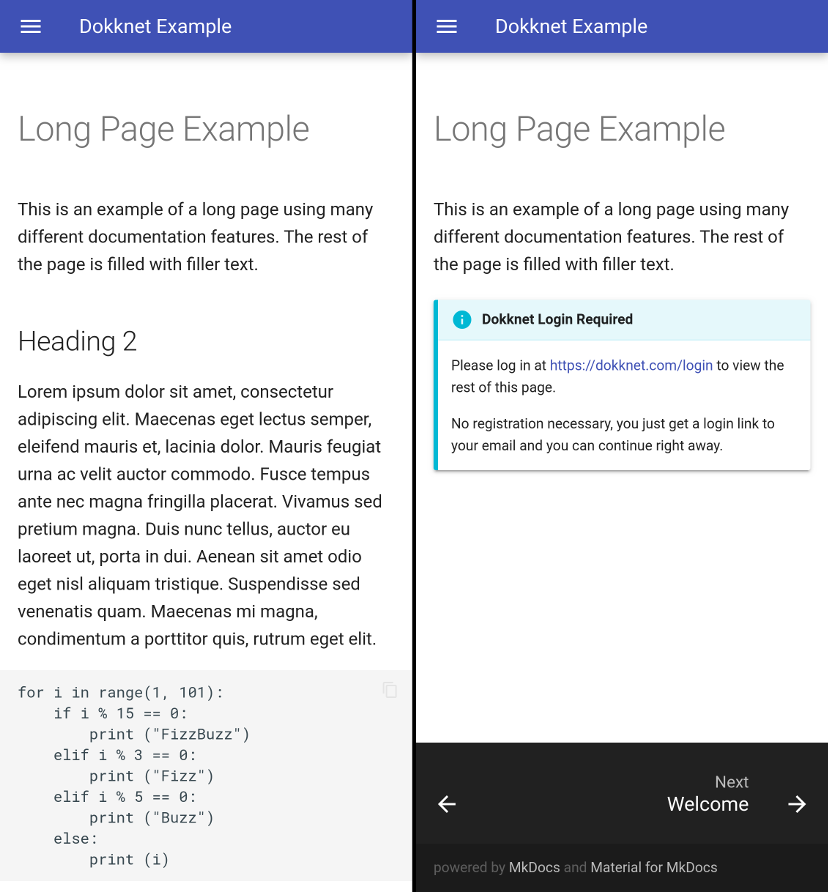

[Dokknet](https://dokknet.com) is a paywall-as-a-service for open source documentation sites. This post explains the rational and technical details of the its paywall design. You can read more about the paywall in [A New Open Source Business Model.](https://blog.agostbiro.net/2020/01/a-new-open-source-business-model/)

## Primary goal

The goal of the paywall design is to make it easier to comply with the paywall than to work around it. I believe this goal can be met if

1. The paywall can not be blocked with existing tools (eg. ad-blockers).
2. There are generous free views for sporadic usage.
3. Authentication is hassle free.
4. There is a free subscription option for individual users that is in no way inferior to the paid option.

## Secondary goals

1. User privacy
2. Ease of integration
3. Minimal latency overhead
4. Minimal costs
5. No negative SEO impact

## Non-goals

The paywall design in its current form is not designed to offer technical protection from:

1. Cookie manipulation beyond cookie blocking
2. Credential sharing schemes

Since browser addons allow manipulating HTTP-only cookies, the only way to block these attacks would be through privacy-invasive measures (IP address and browser fingerprinting). I believe the incentive to engage in such attacks at scale is negligible given the free view options, so the paywall can do without these invasive methods.

## Can't block this

There are various browser addons available today that can be used to block paywalls. These generally rely on one or more of the following techniques:

- removing HTML overlays
- blocking scripts
- blocking cookies

To render these methods ineffective, the Dokknet paywall authorizes views with server-side logic running on the host that serves the content. The server makes authorization decisions based on cookies and refuses to serve content if the paywall counter cookie is missing.

## Free DOM

Developers who use an open source project daily in their paid work should subscribe to that project's paywall. These developers most likely work for corporations today. With this in mind, we won't require authentication for a preset number of views in a moving window (free views). Specifically, the prototype allows 10 free views and the counter resets if the last view was more than 24 hours ago. The number of free views will be configurable for each site with a minimum enforced across all sites to make sure that users are not incentivized to circumvent the paywall.

Once free views are exhausted, the user needs to log in to their Dokknet account to continue accessing the site. A single login gives the user access to all documentation sites where they have a valid subscription.

User authentication is performed on [https://dokknet.com/login](https://dokknet.com/login) where the user enters their email address and receives a login link with a one-time password (OTP) that logs them into their Dokknet account. The OTP is designed to be easy to enter manually in case the user doesn’t have access to their email on the same machine where they want to log in. There is no distinction between registration and login from the user’s point of view. On their first login from a partner site, users are automatically signed up for a free 14-day trial to that site (no credit card required).

## Integration

Open source developers need to perform two actions to integrate the paywall on their documentation sites:

1. Use a plugin for their documentation framework.
2. Install a middleware on their hosting solution.

### Documentation Framework Plugin

The documentation framework plugin generates paywall pages for each page in the documentation. The paywall pages contain an abridged version of the page and a message informing the user that they have to log in to view the rest of the content. The challenge of creating these plugins is that there are many documentation frameworks with varying degrees of plugin support.

### Paywall Middleware

The paywall middleware authorizes access to walled content. It verifies access tokens from cookies, manages counter tokens and authorizes search spiders based on their IP.

There are two major challenges for the paywall middleware: First, it must create a minimal maintenance burden for OS maintainers. Second, there are many hosting solutions for open source documentation and not all of them support user-configurable middleware. The simplest middleware solution is Cloudflare Workers, so if a site is on Cloudflare or can move to Cloudflare, they are covered. Other options are AWS Lambda@Edge, web framework middleware plugins and an Nginx plugin. I hope that static site hosting solutions without user-configurable middleware (eg. Github Pages) will provide Dokknet integration as a feature in the future if open source maintainers request it.

#### Anonymous Authorization

The paywall middleware performs anonymous authorization with a counter token that is sent in a cookie. The server responds with a \`Set-Cookie\` and a \`302\` temporary redirect to the same resource if the counter cookie is missing. Thus complying clients get the resource on the second request, but clients that block Dokknet cookies will enter into an infinite redirect loop (browsers will refuse to load the content with too many redirects error).[^1] The middleware resets the counter if the last view was outside a preconfigured window (24 hours in the prototype) and increments the counter otherwise. If the counter reaches a preconfigured amount (10 in the prototype), it responds with a paywall page that notifies the user that they need to log in at [https://dokknet.com/login](https://dokknet.com/login).[^2]

#### User Authentication and Authorization

Users can request a one-time password (OTP) on [https://dokknet.com/login](https://dokknet.com/login) to log in. The OTP is sent via email and authenticates the user with an AWS Cognito User Pool. Upon successful authentication, an XHR request is sent from the login page with the Cognito access token as authorization to the Dokknet API to retrieve an HTTP-only session cookie for [https://dokknet-api.com](https://dokknet-api.com).

When a user visits a documentation site, [https://docs.example.com](https://docs.example.com), an XHR request including the session cookie is sent to the Dokknet API to request an access token for the site. If the user has a valid subscription, an anonymous access token that is valid for 24 hours and signed with public key cryptography is returned. The JavaScript from the front-end paywall plugin on [https://docs.example.com](https://docs.example.com) then sets this access token as a cookie for [https://docs.example.com](https://docs.example.com). The paywall middleware serving [https://docs.example.com](https://docs.example.com) verifies the claim in the token with the public key retrieved from the Doknet API and serves the requested resource if the access token was verified or a paywall page if the user has exhausted their free views and the claim could not be verified.[^3]

## Social Over Technical

You might be thinking that this is all nice and well, but what prevents someone from viewing documentation sites exclusively in private windows and resetting the window when they’ve reached the free view limit? Nothing prevents them, but if you’re like me and spend your work days with 10+ tabs opened into various documentation sites, resetting private windows gets annoying very quickly. If you’re an independent programmer, ask yourself: do you really want to play the private window game when you could sign up for a free subscription if you can’t afford to pay more? If you’re an engineering manager, you should ask yourself: do you annoy the hell out of your team by making them do the private window dance to save $100 a month? Or do you make them sign up for free subscriptions thus cheating open source devs out of their livelihood? Both choices will make your engineers look for a better employer quickly. This is why the Dokknet paywall is more of a social mechanism than a technical solution and its success depends on creating the right incentives instead of technical sophistication.

[^1]: Search engine spiders can access without cookies as they are authorized based on IP.
[^2]: Signing the counter cookie wouldn’t make it harder to manipulate it, because if a client can modify a cookie, they can also delete it, in which case the client would get a new counter after a 302.
[^3]: The free view settings must be synchronized with the expiration of the access token to make sure that a user with a valid session cookie is never denied access. (Ie. make sure that there are enough free views that allow the page to load the access token.)
