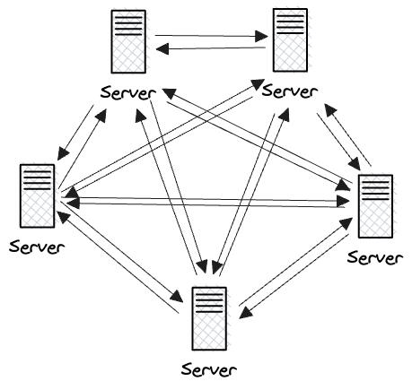
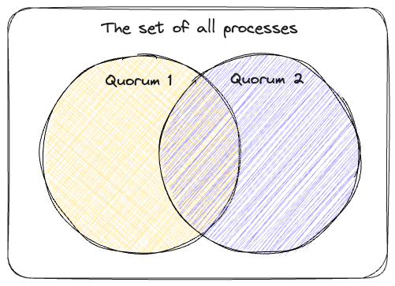
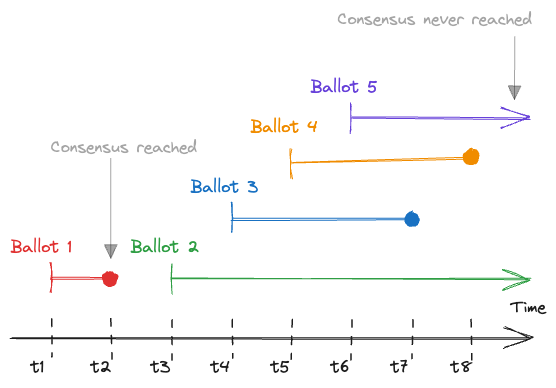
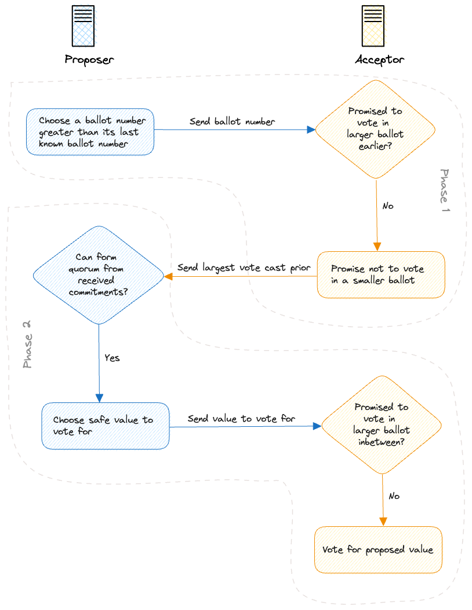

Paxos is a fault-tolerant distributed consensus algorithm invented by Leslie Lamport. A fault-tolerant distributed consensus algorithms lets us for example run a database on multiple servers simultaneously to make the database resilient to hardware failures.

Dr. Lamport [initially tried to prove](https://youtu.be/RFkzp7WXAT4?t=109) that a fault-tolerant distributed consensus algorithm cannot exist and in the process discovered a very elegant solution the problem. Such solutions can be difficult to understand if the reader is not well versed in the problem. In this post, I’ll walk you through the problem from first principles to arm you with the knowledge that makes Paxos easy to understand.

We start at the highest level of abstraction, which is the consensus problem. Then we proceed to refine the problem until we arrive at the Paxos algorithm. For the sake of brevity, we’ll only focus here on how consensus is reached and ignore related problems such as how a value is proposed or how processes learn what value was chosen.

The post contains minimal mathematical notation but it links to the relevant sections of the [TLA+](https://lamport.azurewebsites.net/tla/tla.html) specification of Paxos for precise formulations. TLA+ is a formal specification language that was developed by Dr. Lamport. It is the most widely used specification language for distributed systems in the industry.

I find that complete, precise natural language statements of the algorithm are substantially more difficult to understand than the [mathematical formulation](https://github.com/tlaplus/Examples/blob/6cd12a015c1e2b4355ca442d489c8d973b46cbf4/specifications/PaxosHowToWinATuringAward/Paxos.pdf) so this post won’t attempt one. Instead, I give a high level overview of the algorithm and then show in detail why it’s correct. As a follow up, I recommend Dr. Lamport’s [lecture](https://www.youtube.com/watch?v=tw3gsBms-f8) on the TLA+ spec which makes the mathematical formulation accessible with basic set theory and propositional logic knowledge.

## Consensus

At the highest level of abstraction, consensus is the problem of multiple **processes** **agreeing** on a **single value.**

### Processes

Processes are a generic name for things that execute the consensus algorithm. For distributed databases, a process is typically a node (a server). Messages between nodes are sent over the network and the delivery of messages can be delayed, delivered multiple times, or lost. Nodes may crash and fail to send  messages indefinitely. It’s also possible that a network partition occurs where mutually exclusive groups of nodes can communicate with each other, but not with members of other groups.

### Single Value

We said that consensus is the problem of multiple processes agreeing on a single value. To be more precise, we require that in a consensus algorithm a single value is chosen such that:

1. There is either zero or one value chosen at any time. ([spec](https://github.com/tlaplus/Examples/blob/6cd12a015c1e2b4355ca442d489c8d973b46cbf4/specifications/PaxosHowToWinATuringAward/Consensus.tla#L69))
2. Once a value has been chosen it cannot change at a later time. ([spec](https://github.com/tlaplus/Examples/blob/6cd12a015c1e2b4355ca442d489c8d973b46cbf4/specifications/PaxosHowToWinATuringAward/Consensus.tla#L54))

### Agreement

There are many possible definitions of agreement. For example, we could require that all processes must agree on a value to reach consensus. This is a valid definition of agreement, but it doesn’t work well if we want our algorithm to be fault-tolerant, since the failure of any given node would block consensus. Instead, we need a definition of agreement that will let us ignore some of the processes in order to allow progress in the presence of faults.

How many processes can we ignore? If we knew that 9 out of 10 processes will never vote, we could safely ignore those 9 processes and be certain that only one value will be chosen. But we are operating in a setting where messages can take arbitrarily long to deliver so no process can be certain that another process will never vote and thus can be safely ignored. We need a solution where a **process can safely ignore the votes of some other processes without receiving any messages about them.** The solution is to require that given 2N + 1 processes, N + 1 processes have to vote for the same value in order to reach agreement. The minimum number of processes required to vote for the same value (N + 1 in this case) are called a *quorum* in Paxos terminology.

This quorum value works, because once a process learns that N + 1 processes have voted for a value, it can be certain that the remaining N processes cannot form a valid quorum choosing a different value (as long as each process only votes for one value). This way the votes of the remaining N processes can be safely ignored. Note that we could require our quorum size to be N + 2 or N + 3 as well, but we want to be able tolerate as many faulty processes as possible and N + 1 quorum size is the optimal choice for that.

## Repeated Voting

We have established that agreement is reached by a group of processes if a quorum is formed. But we cannot guarantee that a quorum is always reached since processes may fail to vote in any given vote. In fact, it may suffice for a single process to fail in order to block a quorum. For example, given 2N + 1 processes, a quorum is never reached if N processes vote for one value, N processes vote for another value and one process never votes. We **need to be able to retry** if that happens.

The solution is to refine our notion of consensus and introduce the concept of **repeated voting** performed in multiple rounds where separate quorums can be formed in each round.

A round of voting is called a *ballot* in Paxos terminology. We **assume that there is a linear ordering of ballots** so we can assign a unique natural number to each ballot as its ordinal. ([spec](https://github.com/tlaplus/Examples/blob/6cd12a015c1e2b4355ca442d489c8d973b46cbf4/specifications/PaxosHowToWinATuringAward/Voting.tla#L36)) This lets us determine which process voted for which value in the first ballot, in the second ballot and so on. Note that assuming a linear ordering doesn’t imply a synchronized global counter (which would be a single point of failure). For example, if processes are assigned globally unique identifiers, then each process can keep its own ballot counter and break ties based on process ids.

Repeated voting solves the problem of failures, but it introduces a new one. Supposed that given 2N + 1 processes, N processes have voted for a value in a ballot, but we haven’t heard yet from the rest. It’s possible that their messages are simply delayed, but it’s also possible that the messages are forever lost. Should we wait for a response or start a new ballot? The logical choice is to start a new ballot, but now **quorums can be formed in both ballots for potentially different values** if the messages were simply delayed in the first ballot. So the result of which ballot should we accept as valid? We can’t just say the processes should “agree” which ballot to pick since that’s the problem that we’re trying to solve! We need a “pre-agreed” solution.

Suppose that we always picked the first ballot in which a quorum was formed. This would put us back to square one since now we have to wait for the result of every ballot prior to a ballot in which a quorum was formed, so in the presence of lost messages, consensus could be only reached if a quorum forms in the first ballot. Similarly, if we always picked the last ballot in which a quorum was formed, we would have to wait for the result of every ballot after a quorum which would effectively prevent us from starting new ballots. Uh-oh.

What if, instead of trying to come up with a condition for choosing a ballot from multiple ones with potentially different quorum values, we flipped the problem on its head and tried to figure out how to avoid having to choose a ballot? Our problem is not that quorums can be formed in multiple ballots, but that they can choose multiple values. Could we maybe guarantee that the same value will be chosen in all ballots? We could then **pick the result of any ballot** that reached a quorum and we could be certain that no quorum in any other ballot will pick a different value.

### Repeated Voting Invariant

In order to guarantee that only one value can be chosen in a repeated voting process we can enforce the following two invariants:

1. Processes can only vote for the same value in a ballot. ([spec](https://github.com/tlaplus/Examples/blob/6cd12a015c1e2b4355ca442d489c8d973b46cbf4/specifications/PaxosHowToWinATuringAward/Voting.tla#L139))
2. A process can only vote for a value *v* in ballot *b* if *v* is **safe to vote** for at *b.* A value *v* is safe at *b* if "no value other than *v* has been or ever will be chosen in any ballot numbered less than *b*”. ([spec](https://github.com/tlaplus/Examples/blob/6cd12a015c1e2b4355ca442d489c8d973b46cbf4/specifications/PaxosHowToWinATuringAward/Voting.tla#L149))

**Theorem:** These two conditions imply that **at most one value can be chosen** through repeated voting.

**Proof:** Suppose that some arbitrary value *v1* is chosen in ballot number *b1*, and some other arbitrary value *v2* is chosen in ballot number *b2.*

- Case *b1* = *b2:* The first condition implies *v1* = *v2.*
- Case *b1* ≠ *b2:* The second condition for the largest of *b1* and *b2* implies that no process could have voted in that ballot unless *v1* = *v2.* (Remember that we assumed a linear ordering of ballots.) ([Source](https://youtu.be/tw3gsBms-f8?t=2391))

If we can enforce these two conditions in repeated voting, we can sidestep the problem of deciding the result of which ballot to accept since quorums in different ballots will choose the same values. But how can we implement such a voting process? The bad news is that we probably won’t figure this out here since the solution was worthy of a Turing award. The good news is that thanks to our efforts in trying to find a solution, we’re in a good position to understand it now.

## Paxos

The Paxos algorithm describes how to perform a single ballot in a repeated voting process such that our [two invariants](#repeated-voting-invariant) are satisfied.

Paxos introduces the concept of *proposers* and *acceptors* to repeated voting. A proposer initiates a ballot and acceptors vote in the ballot. Each process can be both a proposer and an acceptor.

The algorithm operates in two phases:

In the **first phase,** a proposer (that can be any process) tries to initiate a ballot by sending a prepare message to the acceptors with a ballot number. ([spec](https://github.com/tlaplus/Examples/blob/6cd12a015c1e2b4355ca442d489c8d973b46cbf4/specifications/PaxosHowToWinATuringAward/Paxos.tla#L145)) The ballot number is ideally larger than the last ballot’s number for performance, but the correctness of the algorithm is unaffected by this. In the second step, the acceptors respond to the prepare message by the proposer by promising that they won’t vote in a ballot number lower than the proposed one. The acceptors also send the last vote they cast including its value and ballot number. ([spec](https://github.com/tlaplus/Examples/blob/6cd12a015c1e2b4355ca442d489c8d973b46cbf4/specifications/PaxosHowToWinATuringAward/Paxos.tla#L163))

In the **second phase,** the proposer collects responses by the acceptors and checks whether a quorum can be formed by the responding acceptors such that no acceptor would vote for a value that it hasn’t voted before based on the state of affairs when the acceptor sent its message in the first phase. If such a quorum is possible, the proposer then sends another message to the acceptors in the quorum asking them to vote for the value. ([spec](https://github.com/tlaplus/Examples/blob/6cd12a015c1e2b4355ca442d489c8d973b46cbf4/specifications/PaxosHowToWinATuringAward/Paxos.tla#L228)) The acceptors then check that they haven’t promised voting in a newer ballot yet, and if they haven’t, they vote for the value. ([spec](https://github.com/tlaplus/Examples/blob/6cd12a015c1e2b4355ca442d489c8d973b46cbf4/specifications/PaxosHowToWinATuringAward/Paxos.tla#L251)) If a quorum of acceptors complete this step for a ballot, then a value is chosen in that ballot.

| Phase 1 | Phase 1 | Phase 2 | Phase 2 |
| --- | --- | --- | --- |
| Step 1 | Step 2 | Step 3 | Step 4 |
| Proposer: Initiate Ballot | Acceptors: Promise | Proposer: Propose Value | Acceptors: Vote |

The two-phased proposer-acceptor architecture of the algorithm enables a single proposer to check if a value is [safe to vote for](#repeated-voting-invariant) in a ballot. After this step each acceptor can check on its own whether they’ve promised to vote in a newer ballot (thus invalidating preconditions) before actually voting. An acceptor doesn’t have to be mindful before voting whether safe voting preconditions still hold for other acceptors, since no agreement will be reached if a majority doesn’t vote in the ballot. But if a value is chosen, then it’s guaranteed that the same value will be chosen in all other ballots, since quorums in two ballots must have at least one member in common.

### Correctness

Let’s discuss now why Paxos is correct in a Q&A format and expand on the details of the algorithm.

**Q1. How do we guarantee the first invariant, namely that processes can only vote for the same value in a ballot?**

This is achieved by the fact that a ballot can be only initiated by a proposer and only one vote can be started for a ballot number ([spec](https://github.com/tlaplus/Examples/blob/6cd12a015c1e2b4355ca442d489c8d973b46cbf4/specifications/PaxosHowToWinATuringAward/Paxos.tla#L217)) and acceptors only vote for values proposed by a proposer. ([spec](https://github.com/tlaplus/Examples/blob/6cd12a015c1e2b4355ca442d489c8d973b46cbf4/specifications/PaxosHowToWinATuringAward/Paxos.tla#L251))

The requirement that only one vote can be started for a ballot number is achieved in practice by implementing ballot numbers as composites from an integer part and a globally unique identifier of the process. For example, (N, UUID) would be the nth ballot where the proposer is a process with the corresponding globally unique identifier. This gives a linear ordering of the ballots and makes sure that each ballot number can be only started by one process. With this ballot number scheme, a single process can guarantee that only one vote is started for each ballot without coordination.

**Q2. What happens if a proposer starts a ballot number *c* that is lower than the largest initiated ballot number *b*?**

A) If, given 2N + 1 processes, N + 1 processes have already promised to vote in ballot *b* prior to starting ballot *c,* then the proposer will never receive enough responses for ballot *c*, because acceptors don’t respond to ballots if they have already promised to vote in a larger numbered ballot in the first phase. ([spec](https://github.com/tlaplus/Examples/blob/6cd12a015c1e2b4355ca442d489c8d973b46cbf4/specifications/PaxosHowToWinATuringAward/Paxos.tla#L166))  Since a quorum can never be reached in ballot *c,* it never enters the second phase and a vote will never be attempted. ([spec](https://github.com/tlaplus/Examples/blob/6cd12a015c1e2b4355ca442d489c8d973b46cbf4/specifications/PaxosHowToWinATuringAward/Paxos.tla#L218))

B) If, given 2N + 1 processes, at most N processes have promised to vote in ballot *b* when ballot *c* is started, then the proposer of ballot *c* may receive N + 1 responses from the acceptors in the first phase to initiate a vote. In this case, ballot *c* can enter the second phase and the proposer starts a vote. In response, each acceptor will check if it hasn’t promised to vote in a larger numbered ballot, ([spec](https://github.com/tlaplus/Examples/blob/6cd12a015c1e2b4355ca442d489c8d973b46cbf4/specifications/PaxosHowToWinATuringAward/Paxos.tla#L248)) and if it hasn’t, it can safely vote, so consensus will be reached in ballot *c* in spite of it not being the largest ballot number at the time it was initiated. Now it’s up to ballot *b* to ensure that it [votes safe,](#repeated-voting-invariant) namely that it doesn’t vote for another value than what was chosen in ballot *c.*

**Q3. How is it ensured that a larger numbered ballot cannot vote for a value other than what is chosen in a lower numbered ballot?**

This is the [safe voting invariant](#repeated-voting-invariant) which is ensured in two parts in the second phase:

1. Before the proposer initiates a vote, it checks that the quorum of acceptors (that have promised not to vote in a lower numbered ballot) have not voted before for a value other than the currently proposed one. ([spec](https://github.com/tlaplus/Examples/blob/6cd12a015c1e2b4355ca442d489c8d973b46cbf4/specifications/PaxosHowToWinATuringAward/Paxos.tla#L224))
2. Then in the second step, before an acceptor actually votes, it checks that it hasn’t promised to vote in a higher numbered ballot yet. ([spec](https://github.com/tlaplus/Examples/blob/6cd12a015c1e2b4355ca442d489c8d973b46cbf4/specifications/PaxosHowToWinATuringAward/Paxos.tla#L248))

How does the proposer pick a value to maintain the safe voting invariant? There are **two cases** to consider:

A) In case no votes were cast prior to the acceptors’ promises in the first phase, the proposer can pick any value. ([spec](https://github.com/tlaplus/Examples/blob/6cd12a015c1e2b4355ca442d489c8d973b46cbf4/specifications/PaxosHowToWinATuringAward/Paxos.tla#L224))

B) In case a vote was cast prior to the acceptors’ promises in the first phase, the proposer only initiates a vote for a value if it matches the highest numbered ballot’s value that an acceptor in the quorum has voted for. ([spec](https://github.com/tlaplus/Examples/blob/6cd12a015c1e2b4355ca442d489c8d973b46cbf4/specifications/PaxosHowToWinATuringAward/Paxos.tla#L226)) The proposer knows what was the highest ballot number and value that each acceptor in the quorum has voted for prior to starting the ballot, because the acceptors send this information in the first phase. ([spec](https://github.com/tlaplus/Examples/blob/6cd12a015c1e2b4355ca442d489c8d973b46cbf4/specifications/PaxosHowToWinATuringAward/Paxos.tla#L169))

Now let’s review why each case is correct.

**Case A) is correct,** because

1. If no votes votes were cast prior to the acceptors’ promises, then clearly no value was chosen in a lower numbered ballot prior to starting the ballot.
2. A quorum of acceptors promised to not to vote in a lower numbered ballot, and it’s not possible to form two quorums without overlapping members, so no value will ever be chosen in a lower numbered ballot either.

To see **why case B) is correct,** suppose that ballot *b* is the current ballot number and ballot *c* is the largest ballot number where a vote was cast prior to the acceptors’ promises in the first phase of *b* s.t *c < b.*

Clearly, no acceptor in the quorum has voted in ballot *d* s.t. *c < d < b* prior to the acceptors’ promises in the first phase of ballot *b.* We can make the overlapping quorums argument that we made for case A) that **no value will ever be chosen in ballot *d.***

Let’s also assume that *c* is the smallest ballot number where a vote was cast. Then, the proposer in ballot *c* can pick any value by case A), since

1. *c* is the smallest ballot number where a vote was cast,
2. and an acceptor could only participate in phase 1 of *c* if it hasn’t promised to vote in a larger numbered ballot,

so **no acceptor in *c* could’ve voted in another ballot prior** to promising to vote in the first phase of  *c.*

We have that the value voted for in ballot *c* is correct by case A), so we must show now that as a result, the value voted for in ballot *b* is correct as well. Since

1. votes were cast in *c* prior to acceptors’ promises in the first phase of *b* by assumption,
2. and acceptors in *b* could have only voted in *c* prior to promising to vote in the first phase of *b,*
3. and because the quorums in *b* and *c* must overlap,

**the proposer in *b* will pick the value voted for in *c*.**

We should note that the proposer in ballot *b* doesn’t know if the vote succeeds or fails in *c*, it only knows that votes were cast. Fortunately, it’s **irrelevant** for the correctness of ballot *b* **whether the vote succeeds or fails in *c,*** since

1. If the vote in ballot *c* succeeds, then the proposer in *b* has picked the only value chosen in a previous ballot so the size of the set of chosen values is one.
2. If no value is chosen in ballot *c,* then the lowest numbered ballot where a value can ever be chosen is *b* by the overlapping quorums argument we made for case A), so the size of the set of chosen values is zero or one.
3. Since the proposer in ballot *b* picked the value voted for in ballot *c,* it cannot reduce the size of the set chosen values from one to zero, so it does not violate our requirement of consensus that once a value has been chosen it cannot change at a later time.

We now have **by strong induction** that **case B) is correct.**

A similar, but to me personally less intuitive argument can be found on page 8 of the [Fast Paxos paper.](https://www.microsoft.com/en-us/research/wp-content/uploads/2016/02/tr-2005-112.pdf)  A more rigorous proof can be found in [The Part-Time Parliament paper.](https://lamport.azurewebsites.net/pubs/lamport-paxos.pdf)

**Q4. How does the algorithm terminate?**

The Paxos algorithm only guarantees safety, not termination. In fact, the [FLP impossibility theorem](https://en.wikipedia.org/wiki/Consensus_(computer_science)#The_FLP_impossibility_result_for_asynchronous_deterministic_consensus) proves that no deterministic fault tolerant consensus algorithm can simultaneously guarantee termination and safety.

Consider the following simple pathological example that can continue forever without termination for three processes A, B, C:

1. Process A starts ballot 1. Processes A, B promise to vote in ballot 1.
2. Process C starts ballot 2. Processes B, C promise to vote in ballot 2.
3. Ballot 1 fails, because B has promised to vote in ballot 2 before voting in ballot 1.
4. Process A starts ballot 3. Processes A, B promise to vote in ballot 3.
5. Ballot 2 fails, because B has promised to vote in ballot 3 before voting in ballot 2.
6. Process C starts ballot 4…

In practice, implementations will use various heuristics to make it very unlikely that the algorithm won’t terminate. And if the system seems stuck, the human administrators can restart it with confidence that the safety properties of consensus haven’t been violated.

Note that the algorithm doesn’t need a termination condition for processes to learn about the result of the vote, since they can the pick the value chosen by any ballot as the algorithm guarantees that all ballots choose the same value.

## Sources

- [Leslie Lamport — The Part-Time Parliament](https://lamport.azurewebsites.net/pubs/lamport-paxos.pdf)
- [Leslie Lamport — Paxos Made Simple](https://lamport.azurewebsites.net/pubs/paxos-simple.pdf)
- [Leslie Lamport — Fast Paxos](https://www.microsoft.com/en-us/research/wp-content/uploads/2016/02/tr-2005-112.pdf)
- [Leslie Lamport — The Paxos algorithm or how to win a Turing Award. Video Part 1.](https://www.youtube.com/watch?v=tw3gsBms-f8)
- [Leslie Lamport — The Paxos algorithm or how to win a Turing Award. Video Part 2.](https://www.youtube.com/watch?v=8-Bc5Lqgx_c)
- [Leslie Lamport — The Paxos algorithm or how to win a Turing Award. Accompanying material.](https://jugruorg.sharepoint.com/:f:/s/presentations/Ejmc_Rk9ddBKhHQEuRHPAFcBpgoiT7frDK0r6K0GUaDGKw?e=1UJQfo)